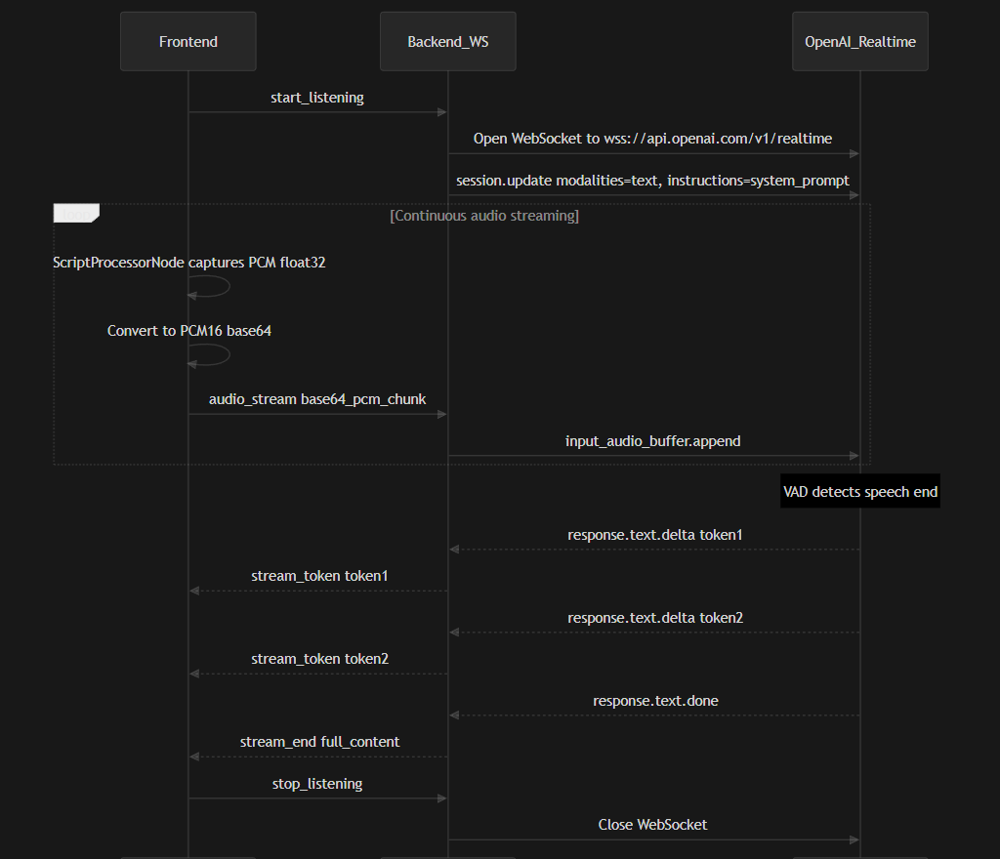

# Orbicall — Intelligent Video Calling Platform

A full-stack video conferencing application with an AI-powered meeting assistant, real-time collaborative code editor, live translation, and more — built for modern remote collaboration.

---
<a href="https://orbicall.in/"><a/>


## Table of Contents

- [Problem Statement](#problem-statement)
- [Problem Solution](#problem-solution)
- [Project Description](#project-description)
- [Project Scope](#project-scope)
- [How to Start on Your Local PC](#how-to-start-on-your-local-pc)
- [System Design](#system-design)
- [Architecture — Whole System](#architecture--whole-system)
- [Architecture — AI Assistant](#architecture--ai-assistant)
- [Contribution Guidelines](#contribution-guidelines)

---

## Problem Statement

Remote communication tools like Google Meet and Zoom have become essential, but they lack intelligent, context-aware assistance during meetings. Participants often struggle with:

- **No real-time meeting intelligence** — there is no built-in AI that can listen, understand, and respond to meeting discussions as they happen.
- **Language barriers** — multilingual teams have no native live-translation or text-to-speech support within the call.
- **Disconnected collaboration** — developers need to switch between the video call and external code editors/IDEs to write and run code together, breaking the flow of discussion.
- **Manual note-taking** — generating meeting summaries, action items, and minutes is a tedious manual process done after the meeting ends.
- **No interview/assessment tooling** — conducting technical interviews or online coding assessments requires stitching together multiple third-party tools.

There is a clear need for a unified video calling platform that combines high-quality communication with real-time AI assistance, live translation, and integrated collaborative development tools.

---

## Problem Solution

We built **Orbicall**, a single platform that addresses every gap listed above:

| Problem | Our Solution |
|---------|-------------|
| No real-time meeting intelligence | An **AI Assistant** that captures meeting audio in chunks, transcribes via **Sarvam STT** (Groq Whisper fallback), detects questions with a turn-based accumulator, and streams intelligent answers using **OpenAI GPT-4o-mini** (Groq fallback). |
| Language barriers | **Live Translation** supporting 20+ languages — meeting audio is transcribed (**Sarvam STT**), translated (**Sarvam Translate**, Groq LLM fallback), and spoken back using **Sarvam TTS** (Azure Neural TTS fallback). Plus browser-native **Live Captions** via Web Speech API. |
| Disconnected collaboration | A built-in **Collaborative Code Editor** (CodeMirror 6 + Yjs CRDT) with real-time multi-cursor editing, syntax highlighting, and integrated code execution for Python, JavaScript, C++, and Java. |
| Manual note-taking | **Background Meeting Transcription** runs throughout the call, and a **Post-Meeting Summary Page** generates structured minutes — summary, key points, action items, decisions, and topics — using **GPT-4o** (Groq fallback). Export as PDF via print dialog. |
| No interview/assessment tooling | Dedicated **Enterprise modules** — interview rooms with AI-assisted evaluation and online assessment pages with CodePair support. |

---

## Project Description

Orbicall is a modern video calling application built on a **modular monolithic architecture**, inspired by Google Meet's clean UI and enhanced with AI-powered features. The backend logic — AI, code execution, and collaborative editing — lives inside a single Python FastAPI process organized into clean modules (routers, services, websockets), while a thin Node.js server handles LiveKit token generation. The platform is composed of four core components:

1. **Frontend** — A Next.js 16 / React 19 application with Tailwind CSS, providing the landing page, video room UI, AI assistant sidebar, code editor panel, and enterprise pages.
2. **Node.js Backend** — A lightweight Express server responsible for LiveKit token generation and room management.
3. **Python Backend** — A FastAPI server hosting all AI capabilities — chat (OpenAI GPT-4o-mini / Groq LLM), transcription (Sarvam STT / Groq Whisper), live translation (Sarvam Translate + Sarvam TTS, with Groq LLM and Azure TTS fallbacks), background meeting transcription, post-meeting structured minutes (GPT-4o / Groq), code execution sandboxing, and Yjs-based collaborative editing sync.
4. **LiveKit Server** — An open-source WebRTC SFU running in Docker, handling multi-participant video/audio streams and screen sharing.

### Key Features

- High-quality multi-participant video and audio calls
- Screen sharing
- Real-time AI assistant that listens to meeting audio, detects questions, and streams intelligent responses
- Text-based AI chat with streaming responses
- Live captions overlay powered by Web Speech API
- Live translation overlay with text-to-speech in 20+ languages (Sarvam / Azure)
- Background meeting transcription that runs throughout the call
- Post-meeting summary page with structured minutes, key points, action items, decisions, and topics (exportable as PDF)
- Collaborative code editor with real-time multi-cursor sync
- Sandboxed code execution (Python, JavaScript, C++, Java)
- Sentiment analysis
- Enterprise interview and online assessment modules

### Tech Stack

| Layer | Technologies |
|-------|-------------|
| Frontend | Next.js 16, React 19, TypeScript, Tailwind CSS 4, Framer Motion, GSAP |
| Video/Audio | LiveKit Client SDK, LiveKit Components React |
| Code Editor | CodeMirror 6, Yjs, y-websocket, y-codemirror.next |
| Node.js Backend | Express, TypeScript, LiveKit Server SDK |
| Python Backend | FastAPI, Uvicorn, Pydantic |
| AI Services | OpenAI (GPT-4o-mini streaming chat, GPT-4o structured summaries), Groq API (LLM fallback + Whisper STT fallback), Sarvam AI (STT, Translation, TTS), Azure Cognitive Services (TTS fallback) |
| Infrastructure | Docker, Docker Compose, Nginx, Certbot (SSL) |

---

## Project Scope

### In Scope

- Real-time video and audio conferencing for up to 50 participants
- AI meeting assistant with real-time audio understanding and text chat
- Live transcription and multilingual translation (20+ languages)
- Collaborative code editor with real-time sync and code execution
- Meeting summaries, key-point extraction, and sentiment analysis
- Enterprise features: interview rooms and online assessments
- Local development setup with one-command startup scripts
- Production deployment via Docker Compose with SSL

### Out of Scope (Future Work)

- Persistent user accounts and authentication (currently stateless)
- Database-backed meeting history and recording storage
- End-to-end encryption for media streams
- Mobile native applications (iOS/Android)
- Calendar integration and meeting scheduling
- Breakout rooms and polling/Q&A features

---

## How to Start on Your Local PC

### Prerequisites

- **Node.js** 18+
- **Python** 3.10+
- **Docker Desktop** (running)
- API keys for: **Groq**, **OpenAI**, **Sarvam AI**, and **Azure Speech Services**

### Quick Start (One Command)

**Windows — double-click:**
```
START.bat
```

**Windows — PowerShell:**
```powershell
.\start-all.ps1
```

**First-time setup (installs all dependencies):**
```powershell
.\start-all.ps1 -Install
```

**Linux / macOS:**
```bash
chmod +x start-dev.sh
./start-dev.sh
```

This starts all four services automatically:

| Service | Port | URL |
|---------|------|-----|
| Frontend | 3000 | http://localhost:3000 |
| Node.js Backend | 3001 | http://localhost:3001 |
| Python Backend | 5000 | http://localhost:5000/docs |
| LiveKit Server | 7880 | ws://localhost:7880 |

### Manual Setup

**1. Create environment files**

`backend/node server/.env`
```env
PORT=3001
LIVEKIT_API_KEY=devkey
LIVEKIT_API_SECRET=secret
LIVEKIT_URL=ws://localhost:7880
```

`backend/python server/.env`
```env
PORT=5000
LIVEKIT_API_KEY=devkey
LIVEKIT_API_SECRET=secret
LIVEKIT_URL=ws://localhost:7880
GROQ_API_KEY=your_groq_api_key
OPENAI_API_KEY=your_openai_api_key
SARVAM_API_KEY=your_sarvam_api_key
AZURE_SPEECH_KEY=your_azure_speech_key
AZURE_SPEECH_REGION=eastasia
```

`frontend/project/.env.local`
```env
NEXT_PUBLIC_API_URL=http://localhost:3001
NEXT_PUBLIC_PYTHON_API_URL=http://localhost:5000
```

**2. Install dependencies**

```bash
# Node.js backend
cd "backend/node server"
npm install

# Python backend
cd "backend/python server"
pip install -r requirements.txt

# Frontend
cd frontend/project
npm install
```

**3. Start each service in a separate terminal**

```bash
# Terminal 1 — LiveKit
docker run -d --name livekit \
  -p 7880:7880 -p 7881:7881 -p 7882:7882/udp \
  -e LIVEKIT_KEYS="devkey: secret" \
  livekit/livekit-server

# Terminal 2 — Node.js Backend
cd "backend/node server" && npm run dev

# Terminal 3 — Python Backend
cd "backend/python server" && python app.py

# Terminal 4 — Frontend
cd frontend/project && npm run dev
```

**4. Open http://localhost:3000 in your browser**

---

## System Design

The application follows a **modular monolithic architecture**. The Python Backend is a single FastAPI process with clearly separated internal modules — `routers/` for API endpoints, `services/` for business logic, and `websockets/` for real-time handlers — rather than independently deployed microservices. The Node.js server exists only as a lightweight token generator. All components communicate over HTTP, WebSocket, and WebRTC protocols.

### Services and Responsibilities

| Service | Technology | Responsibility |
|---------|-----------|---------------|
| **Frontend** | Next.js 16 / React 19 | UI rendering, LiveKit client, user interactions |
| **Node.js Backend** | Express / TypeScript | LiveKit token generation, room management |
| **Python Backend** | FastAPI / Uvicorn | AI chat, transcription (Sarvam/Groq), translation (Sarvam), TTS, background meeting transcription, post-meeting summaries, code execution, collaborative editing sync |
| **LiveKit Server** | LiveKit (Docker) | WebRTC SFU — video/audio routing, screen sharing |

### Communication Patterns

- **Browser ↔ Frontend** — HTTP (page loads, SSR)
- **Frontend → Node.js Backend** — REST API (token requests)
- **Browser ↔ LiveKit** — WebRTC (bidirectional video/audio/data)
- **Browser ↔ Python Backend** — WebSocket (AI chat streaming, background meeting transcription, live translation, Yjs document sync) + REST (code execution, summaries, post-meeting minutes)
- **Python Backend → External AI APIs** — HTTPS (Sarvam AI, OpenAI, Groq, Azure)

### Data Flow Examples

**Joining a meeting:**
```
Browser → Frontend (enter name/room) → Node.js Backend (POST /api/token)
→ LiveKit Server (room created) → Browser connects via WebRTC
```

**AI Assistant responding to a question during a meeting:**
```
Browser captures remote audio in ~3s chunks
→ Python Backend WebSocket (/ws/ai-chat/{id})
→ Sarvam STT (Groq Whisper fallback) → TurnAccumulator (2s silence flush)
→ Question detection → OpenAI GPT-4o-mini streaming (Groq fallback)
→ Streaming response tokens back to Browser
```

**Live Translation:**
```
Meeting audio → Python Backend (/ws/ai-chat/{id}, live_translation_audio)
→ Sarvam STT (transcribe) → Sarvam Translate (target language, Groq LLM fallback)
→ Sarvam TTS (generate speech, Azure Neural TTS fallback)
→ Translated text + audio playback in Browser
```

**Background Meeting Transcription:**
```
Browser captures local + remote audio in ~5s chunks
→ Python Backend WebSocket (/ws/meeting-transcript/{room_id})
→ Sarvam STT (Groq Whisper fallback)
→ Transcript stored in-memory per meeting (meeting_storage)
```

**Post-Meeting Summary:**
```
User leaves meeting → Browser navigates to /room/{roomId}/end
→ POST /api/meeting/end → GPT-4o structured minutes (Groq fallback)
→ Summary, key points, action items, decisions, topics displayed
→ Optional PDF export via print dialog
```

**Collaborative Code Editing:**
```
Browser (CodeMirror + Yjs) ↔ Python Backend (/ws/yjs/{room})
→ Yjs CRDT updates broadcast to all connected participants
```

### API Endpoints (Python Backend)

| Endpoint | Method | Description |
|----------|--------|-------------|
| `/health` | GET | Health check |
| `/api/chat` | POST | AI text chat |
| `/api/transcribe` | POST | Audio transcription |
| `/api/analyze-sentiment` | POST | Sentiment analysis |
| `/api/generate-summary` | POST | Meeting summary generation |
| `/api/execute-code` | POST | Sandboxed code execution |
| `/api/meeting/end` | POST | End meeting and generate structured minutes |
| `/api/meeting/{room_id}` | GET | Get meeting transcript data |
| `/ws/ai-chat/{id}` | WebSocket | AI assistant (audio chunks, text chat, live transcription, live translation) |
| `/ws/meeting-transcript/{room_id}` | WebSocket | Background meeting transcription |
| `/ws/yjs/{room}` | WebSocket | Collaborative editing sync |

Full interactive API docs available at **http://localhost:5000/docs** (Swagger UI).

---

## Architecture — Whole System


The system is composed of four services. The **Browser** connects to the **Next.js Frontend** for the UI, obtains LiveKit tokens from the **Node.js Backend**, and establishes a WebRTC connection with the **LiveKit Server** for video/audio. AI features, code execution, and collaborative editing all flow through the **Python Backend** via WebSocket and REST, which in turn delegates to **Sarvam AI**, **OpenAI**, **Groq API**, and **Azure Cognitive Services**.

---

## Architecture — AI Assistant



The diagram above shows the exact file-level handshake between components. The AI Assistant uses a **chunked audio pipeline** — audio is captured in ~3-second chunks, transcribed server-side via **Sarvam STT** (Groq Whisper fallback), accumulated into conversation turns, and answered by **OpenAI GPT-4o-mini** streaming (Groq fallback). Here is the flow through each file:

### Files Involved

| File | Role |
|------|------|
| `AISidebar.tsx` | Frontend component — captures remote participant audio via Web Audio API in ~3s chunks, base64-encodes, streams over WebSocket, and renders transcriptions + streaming AI responses |
| `ai_chat.py` | Backend WebSocket handler — receives audio chunks, orchestrates STT → TurnAccumulator → question detection → LLM streaming; also handles text chat, live transcription, and live translation |
| `ai_service.py` | Backend service — Sarvam-first STT with Groq Whisper fallback, OpenAI GPT-4o-mini streaming with Groq fallback, Sarvam translation + TTS with Groq/Azure fallbacks, meeting summary generation |
| `sarvam_service.py` | Backend service — async HTTP client for Sarvam AI REST APIs (speech-to-text, translate, text-to-speech) |
| `config.py` | Loads `OPENAI_API_KEY`, `GROQ_API_KEY`, `SARVAM_API_KEY`, `AZURE_SPEECH_KEY`, and language mappings from environment |
| `app.py` | Registers WebSocket endpoints: `/ws/ai-chat/{client_id}`, `/ws/meeting-transcript/{room_id}`, `/ws/yjs/{room_id}` |
| `meeting_transcript.py` | Backend WebSocket handler — dedicated background transcription; receives audio chunks, transcribes, and stores in `meeting_storage` for post-meeting summaries |
| `LiveCaptionsOverlay.tsx` | Frontend component — live captions (Web Speech API) and live translation overlay (server-side STT + Sarvam Translate + TTS) |
| `useBackgroundTranscript.ts` | Frontend hook — continuously sends ~5s audio chunks (local + remote) to `/ws/meeting-transcript/{room_id}` for background transcription |

### Step-by-Step Flow

1. **User clicks "Start AI Assistant"** — `AISidebar.tsx` sends `{"type": "start_listening"}` over WebSocket to `ai_chat.py`.
2. **Audio capture loop (~3s chunks)** — `AISidebar.tsx` captures remote participant audio tracks via LiveKit's Web Audio API, mixes them, base64-encodes the PCM data, and sends `{"type": "audio_stream", "data": base64_audio}` to `ai_chat.py`.
3. **Transcription** — `ai_chat.py` calls `ai_service.transcribe_audio()`, which tries **Sarvam STT** first and falls back to **Groq Whisper** on failure. The transcribed text is sent back as a `{"type": "heard"}` event.
4. **Turn accumulation** — A `TurnAccumulator` (in `ai_chat.py`) buffers incoming transcriptions. After 2 seconds of silence (no new audio), it flushes the accumulated text as a complete conversation turn.
5. **Question detection** — `ai_chat.py` calls `ai_service.is_question()` to determine if the accumulated turn contains a question that warrants an AI response.
6. **LLM streaming** — If a question is detected, `ai_chat.py` calls `ai_service.stream_message()`, which sends the conversation context to **OpenAI GPT-4o-mini** (Groq fallback). Response tokens are streamed back as `{"type": "stream_start"}`, `{"type": "stream_token"}`, and `{"type": "stream_end"}` events.
7. **UI update** — `AISidebar.tsx` renders the transcription ("Heard: ...") and the streaming AI response token-by-token in the chat panel.

### Background Transcription & Post-Meeting Summary

In parallel, `useBackgroundTranscript.ts` continuously sends audio chunks over a separate WebSocket (`/ws/meeting-transcript/{room_id}`) to `meeting_transcript.py`, which transcribes and stores all participant dialogue in-memory. When the meeting ends, the user is redirected to `/room/{roomId}/end`, which calls `POST /api/meeting/end` to generate structured minutes (GPT-4o / Groq) including summary, key points, action items, decisions, and topics.

---

## Contribution Guidelines

We welcome contributions! Please follow these guidelines to keep the codebase clean and the collaboration smooth.

### Getting Started

1. **Fork** the repository and clone your fork locally.
2. Create a new branch from `main` for your feature or fix:
   ```bash
   git checkout -b feature/your-feature-name
   ```
3. Set up the local development environment following the [How to Start](#how-to-start-on-your-local-pc) section above.

### Development Workflow

1. Make your changes in a focused, single-purpose branch.
2. Write clear, descriptive commit messages:
   ```
   feat: add dark mode toggle to settings page
   fix: resolve WebSocket reconnection failure on network change
   docs: update API endpoint documentation
   ```
3. Test your changes locally — ensure all four services start and your feature works end-to-end.
4. Push your branch and open a **Pull Request** against `main`.

### Code Style

- **Frontend** — follow existing TypeScript/React conventions; use functional components and hooks.
- **Python Backend** — follow PEP 8; use type hints; define request/response models with Pydantic.
- **Node.js Backend** — follow existing TypeScript conventions.
- Keep files focused — avoid mixing unrelated changes in a single commit.

### Pull Request Process

1. Give your PR a clear title and description explaining **what** changed and **why**.
2. Reference any related issues (e.g., `Closes #42`).
3. Ensure no new linter warnings or errors are introduced.
4. At least one maintainer review is required before merging.

### Reporting Issues

- Use GitHub Issues to report bugs or request features.
- Include steps to reproduce, expected behavior, and actual behavior.
- Attach screenshots or logs when relevant.

### Code of Conduct

- Be respectful and constructive in all interactions.
- Focus on the technical merits of contributions.
- Help newcomers get started — everyone was a beginner once.

---
